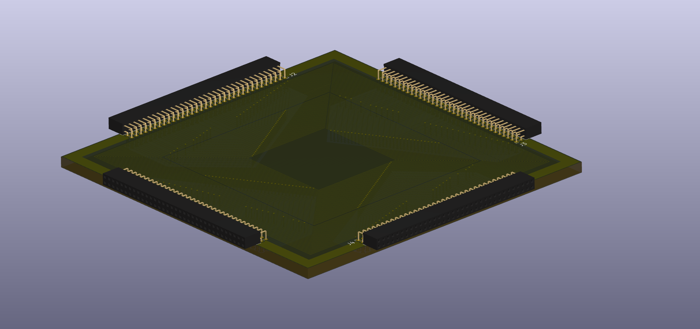
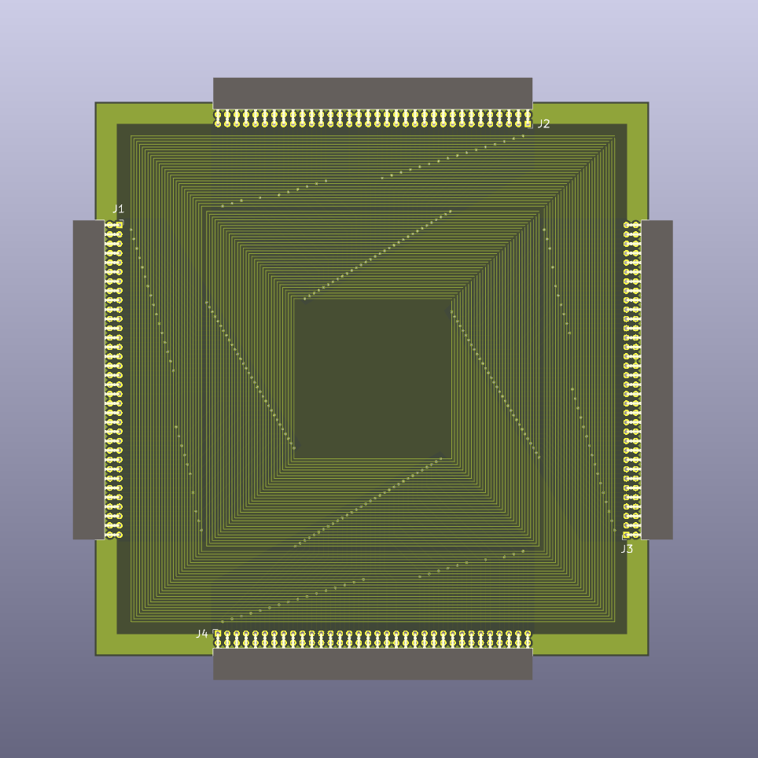
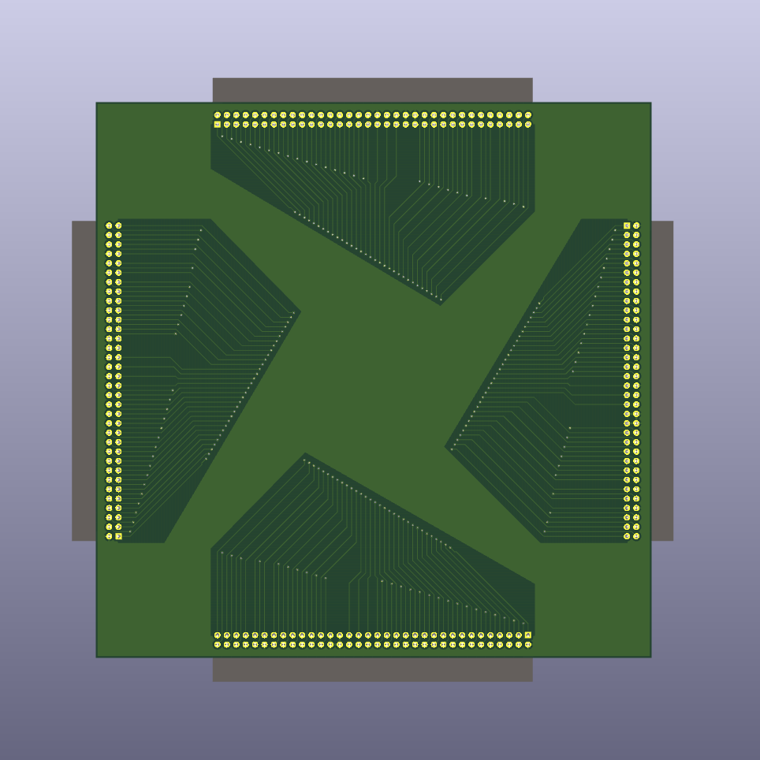

# Explorations of a Motherboard for Scott Baker's Clover Computer

Just playing around, seeing if there was any geometric regularity which
could be exploited to make this layout easier. It looks pretty, but I'm
not sure it would perform any better than the original. 

No signal names assigned other than ground and VCC. Originally I put
power and ground on two inner layers, but realized they could easily be
put on the perimeter of the outer layers.

* Done in Kicad v6. 
  - Schematics printed out as PDF 
  - Layout as two PNG files

